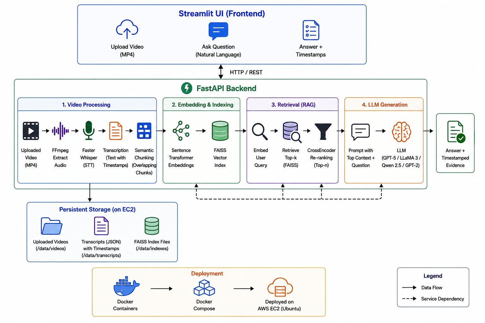

# 🎥 Video RAG: Timestamp-Grounded Video Question Answering
A Retrieval-Augmented Generation (RAG) application that transcribes uploaded videos, constructs timestamped semantic vector indexes, retrieves relevant context using FAISS and CrossEncoder re-ranking, and generates grounded answers using GPT-5, LLaMA 3, Qwen, or GPT-2.

## Features

- Upload MP4 videos through a Streamlit interface
- Automatic speech-to-text transcription using Faster Whisper
- Semantic chunking with timestamp preservation
- FAISS vector database for efficient retrieval
- CrossEncoder re-ranking for improved context selection
- Timestamp-grounded answers with supporting evidence
- Multiple LLM support
  - GPT-5
  - LLaMA 3
  - Qwen 2.5
  - GPT-2
- FastAPI backend
- Dockerized deployment on AWS EC2

---

## Architecture

<p align="center">
  
</p>


## Tech Stack

### Frontend
- Streamlit

### Backend
- FastAPI
- Uvicorn

### Video Processing
- FFmpeg
- Faster Whisper

### Retrieval-Augmented Generation
- Sentence Transformers
- FAISS
- CrossEncoder Re-ranking

### Large Language Models
- GPT-5 (OpenAI API)
- LLaMA 3 (Ollama)
- Qwen 2.5 (Ollama)
- GPT-2 (Transformers)

### Deployment
- Docker
- Docker Compose
- AWS EC2 (Ubuntu)

## Project Structure

```text
video-rag-qa/
│
├── backend/
│   ├── main.py
│   ├── rag.py
│   ├── whisper_utils.py
│   └── ...
│
├── ui/
│   └── app.py
│
├── data/
│   ├── videos/
│   ├── transcripts/
│   └── indexes/
│
├── Dockerfile.backend
├── Dockerfile.ui
├── docker-compose.yml
├── requirements.txt
└── README.md
```

## Running Locally

Clone the repository

```bash
git clone https://github.com/nethra4321/video-rag-qa.git
cd video-rag-qa
```

Create a virtual environment

```bash
python -m venv .venv
```

Windows

```bash
.venv\Scripts\activate
```

Install dependencies

```bash
pip install -r requirements.txt
```

Start the FastAPI backend

```bash
uvicorn backend.main:app --reload
```

Start the Streamlit frontend

```bash
streamlit run ui/app.py
```


## Docker Deployment

Build and run the application

```bash
docker compose up --build
```

Stop the application

```bash
docker compose down
```

---

## Environment Variables

Create a `.env` file in the project root.

```env
OPENAI_API_KEY=your_openai_api_key
OPENAI_MODEL=gpt-5

WHISPER_MODEL=base
WHISPER_DEVICE=cpu
WHISPER_COMPUTE=int8

OLLAMA_URL=http://localhost:11434
OLLAMA_LLAMA3=llama3.2:3b
OLLAMA_QWEN=qwen2.5:3b-instruct
```


## Workflow

1. Upload an MP4 video.
2. Extract audio using FFmpeg.
3. Generate transcripts using Faster Whisper.
4. Split transcripts into timestamped semantic chunks.
5. Create embeddings using Sentence Transformers.
6. Store embeddings in a FAISS vector index.
7. Embed the user's question.
8. Retrieve the most relevant chunks from FAISS.
9. Re-rank retrieved chunks using a CrossEncoder.
10. Generate an answer with GPT-5, LLaMA 3, Qwen, or GPT-2.
11. Display the answer along with supporting timestamped evidence.
